## HackOff v3 - Siemens Challenge 
## Team - Oregon Trail 
Members - Dibya Prakash Das, Akash Chandra, Anirban Panda

### Problem Statement - 1
#### Create algorithm to combine review tags based on meaning

### Description

Many customers review a product and a lot of tags are extracted from them and displayed. But many of them are refer to the same thing and therefore can be combined into one tag. 

Example - "fingerprint scanner", "fingerprint reader", "fingerprint sensor" & "fingerprint" all refer to the same thing and thus can be combined into one tag. 

#### Exploratory Data Analysis
We only consider reviews with more than 1000 characters because then meaningful keyphrases can be extracted. 
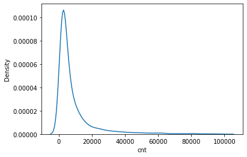

Here is the word cloud of the good ratings :- 
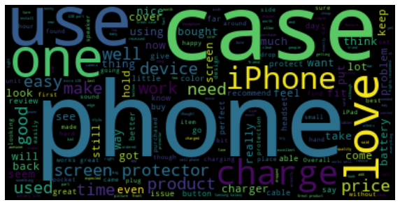

Here is the word cloud of the bad ratings :-
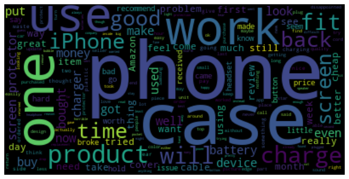

#### Our Approach
Our first step is to extract the keyphrases using PositionRank graph model. 

### PositionRank
* It is an unsupervised Graph-based model for keyphrase extraction 
* We built a graph representation of the document where nodes are words that passes a Part-of-Speech filter 
for example `pos = {'NOUN', 'PROPN', 'ADJ'}`
* Two nodes are connected if the words corresponding to these nodes co-occur within a window of contiguous tokens
* The weight of an edge is computed based on the co-occurrence count of the two words within a window of successive tokens
* Candidate weight calculation is done using a biased PageRank
* Candidate selection is done using a syntactic PoS pattern for noun phrase extraction 
for example `grammar = "NP: {<ADJ>*<NOUN|PROPN>+}"`, implying Keyphrase candidates are noun phrases that match the regular expression `(adjective)*(noun or proper noun)+`, of length up to three

Some other keyword extraction methods tried out were
* Unsupervised models
    * YAKE
 * Graph-based models
    * TopicRank

Then once we have the keyphrases we find the contextual word embeddings using flair of those keyphrases and cluster them using k-means. Since we use contextual word embeddings we therefore have incorporated information from the review text and therefore has produced more meaningful clusters. 

### Flair - Contextual Word embeddings
* Pretrained model on word embeddings but also takes into account the context
* Better results than simply word2vec or glove
* We use stacked embeddings of glove and news-forward-fast and news-backward-fast

The final cluster labels are the keyphrases with the highest PositionRank scores in their respective clusters.

#### Results 

Given example in the problem statement - 
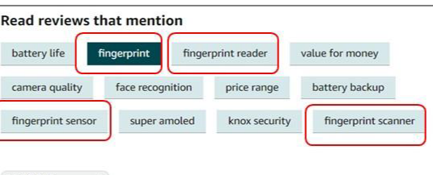

And here are the clusters using our approach
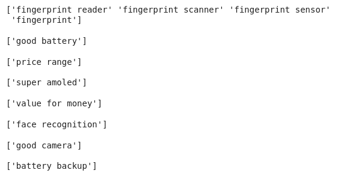

The final review tags :- 
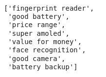

**Another example** :- 

Extracted keyphrases :- 
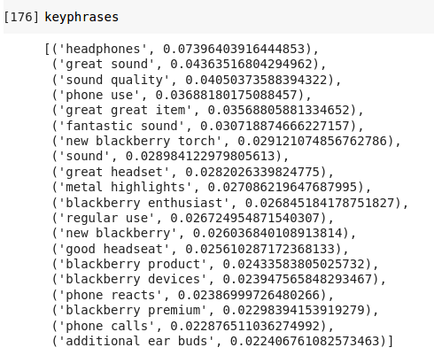

Clusters :- 
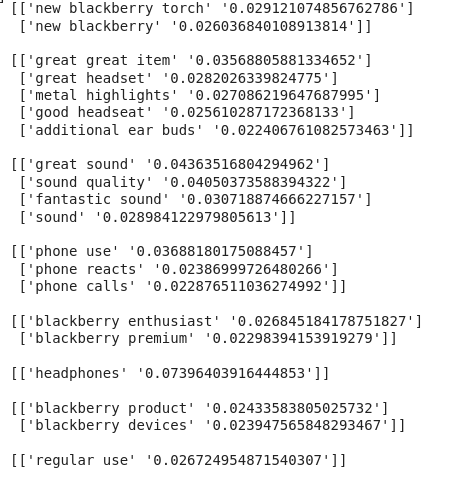

**One more example** :- 

Extracted keyphrases :- 
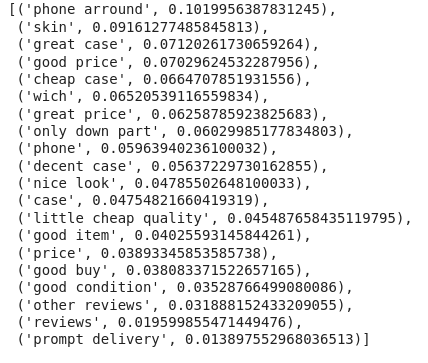

Clusters :- 
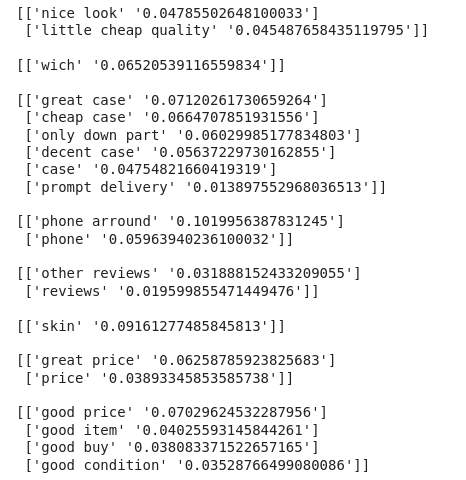

The final review tags :- 
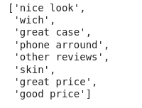

**One more example** :-
Extracted keyphrases :- 
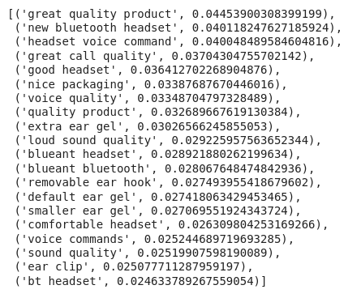

Clusters :- 
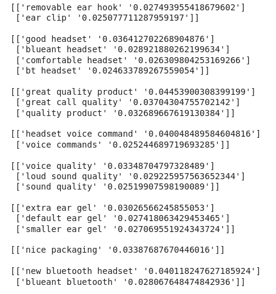

The final review tags :- 
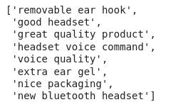

### Improvements
* Can do better preprocessing to remove bad characters 
* Use multilinugal model for supporting languages other than english
* Use a better clustering methods

### References
* [pke](https://github.com/boudinfl/pke)
* [yake](https://github.com/LIAAD/yake)
* [flair](https://github.com/LIAAD/yake)

### Thank you!
